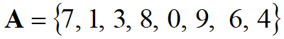

# Data Structures

# Chapter One <Data Structures and Algorithms />

- What is a problem ?
- What is an algorithm ?
- What is a data structure ?
- How to implement ?

## Problem

A **problem** is a mapping from an input to an output.

- Sort: Unsorted data -> Sorted data

## Algorithms

In computer science, **algorithm** refers to a special method useable by a computer for solution of a problem.

Example:

How to find the minimum value in a list of integers?
Solution:
Scan the list from front to end and keep track of the minimum integer found so far.

### Other definitions (related to algorithms)

- I think it is good to understand them
    - **modularity:** Modularity is the degree to which a system's components may be separated and recombined.
    - **correctness:** An algorithm is totally correct if it receives valid input, terminates, and always returns the correct output.
    - **maintainability:** Maintainability determines how easy and profitable it will be to maintain, update, and do upgrades in that software system.
    - **functionality:** refers to the ability of a software application to perform specific tasks or functions
    - **user-friendliness: ​**the quality of being easy for people who are not experts to use or understand.
    - **programmer time:** the time complexity is the computational complexity that describes the amount of computer time it takes to run an algorithm.
    - **simplicity:** An algorithm is simple if it is concise to write down and easy to grasp.
    - **extensibility:** Extensibility is the ability of an algorithm to adapt to new requirements, changes, or scenarios without compromising its functionality, performance, or quality
    - **reliability:** T*he probability of failure-free software operation for a specified period of time in a specified environment*
    - **robustness:** T*he degree to which a software system or component can function* *correctly* *in the presence of invalid inputs or stressful environmental conditions.*

## Data Structures

A **data structure** *is* an arrangement of data in a computer’s memory (or sometimes on a disk).

- Common data structures include
    
    –Arrays
    
    –Stacks
    
    –……
    

## Implement



Problem: Are the values in the array **A** sorted?

```cpp
bool isSorted(const int *A, int n){
   bool sorted = true;

   for (int i=0;  i<n-1;  i++){
      if (A[i] > A[i + 1])
      sorted = false;
    }
   return sorted;
}
```

## Quiz Yourself

[Quiz Yourself](https://quiz-yourself.vercel.app/quizzes/data-structures--chapter-one)

---

# Chapter Two <Introduction to Complexity Analysis of Algorithms />

## Introduction

How to measure the cost of an algorithm ?

Computational complexity indicates how much effort is required for an algorithm or how costly it is.

- Important efficiency/cost criteria are:
    - Time (CPU usage)
    - Space (Memory and disk usage)
    - Network usage

**The time factor** is generally more  important than the others.

## The Execution Time of Algorithms

```
Consecutive statements					**Times**

count = count + 1;                  1
sum = sum + count;                  1
```

Total cost = 1 + 1

→ The time required for this algorithm is constant

```
Single loop statements         Times

	i = 1;						             1
	sum = 0;						           1
	while (i <= n) {			 	     n + 1
		i = i + 1;				           n	
		sum = sum + i;				       n
	}
```

Total cost = 1 + 1 + (n + 1) + n + n

**→** The time required for this algorithm is proportional to n

## Big-O notation

[https://youtu.be/g2o22C3CRfU?si=kC_wqAmQ6shZLx9F](https://youtu.be/g2o22C3CRfU?si=kC_wqAmQ6shZLx9F)

[https://youtu.be/XMUe3zFhM5c?si=nmVipqFQ5bOsfDKP](https://youtu.be/XMUe3zFhM5c?si=nmVipqFQ5bOsfDKP)

We usually need to use the simplest formula when in the Big-O notation.

- We write :


[www.cs.ryerson.ca](https://www.cs.ryerson.ca/~mth110/Handouts/PD/bigO.pdf)


### General rules

**Rule 1:**

The running time of the statements inside the loop x The number of iteration

Example : The following code is  **O(n)**

```cpp
for (i=0; i<n; i++) {
	k++;
}
```

**Rule 2:**

The running time of the statements inside the loop x The product of the sizes of all the loops.

Example : Nested loops. The following code is O(n²)

```cpp
for (i=0; i<n; i++){
  for(j=1, j<=n,j++){
	  k++;
	}
}
```

**Rule 4:**

Time complexity of a function (or set of statements) is considered as O(1) if it doesn’t contain loop, recursion and call to any other non-constant time function.
Example :   a = ARR[5];

**Rule 5:**
O(logn) :Time Complexity of a loop is considered as O(logn) if the loop variables is divided(/) or  multiplied(*) by a constant amount

 Example: How many times the loop will be executed?

```cpp
k=0; // Counter
for(i=n, i>0, i=i/2){// Example :i=32,16,8,4,2,1. 
    k++; // k=5 = log2 32
}

k=0;
for(i=1, i<n, i=i*2){ // i=1,2,4,8,16,32,k=5
    k++;
}
```

Worst-Case, Best-Case, and Average-Case Efficiencies


## Quiz Yourself

[Quiz Yourself](https://quiz-yourself.vercel.app/quizzes/data-structures-chapter-two)

---

# Chapter Three <Introduction to Recursion />

## Recursions

**Recursion** is an effective  programming technique in which a function calls itself.

### Demonstrating Recursion

*Every step contain the previous step →


```cpp
int TotNum(int i){

	if( i == 1 ){
		return 1;
	}else {
		return( i + TotNum(i - 1) );
	}
}
```

The function `TotNum` recursively calculates the sum of all integers from 1 to `i`.


```cpp
int factorial(int n){
	if( n == 1 )	{
		return 1;
	}else {
		return ( n * factorial( n - 1) );
	}
}
```

function `factorial` recursively calculates the factorial of a given number `n`.

### Demonstrating recursions with Fibonacci


```cpp
int Fib( int n ){
	if ( n <= 1){
		return 1;
	}else{
		return Fib( n - 1 ) + Fib( n - 2 );
	}
}
```


[https://youtu.be/YstLjLCGmgg?si=ee_iheRN1YBMPMTe](https://youtu.be/YstLjLCGmgg?si=ee_iheRN1YBMPMTe)

[https://youtu.be/IJDJ0kBx2LM?si=uuuBYt8kjIKqSqgF](https://youtu.be/IJDJ0kBx2LM?si=uuuBYt8kjIKqSqgF)

### A small advice

try to implement recursion functions by yourself because the doctor said that he will most likely put a codding question in the exam

like try implementing 

1. Print Numbers from 1 to N
2. Reverse a String
3. Check Palindrome
4. GCD (Greatest Common Divisor)
5. Power of a Number
6. Find Maximum Element in an Array

functions.

using pseudo code or any language you want (The doctor said that)

## Quiz Yourself

[Quiz Yourself](https://quiz-yourself.vercel.app/quizzes/data-structures-chpter-three)

---

# Chapter Four <Sorting Algorithms and Analysis />

There are many  well known sort algorithms:

- Bubble Sort
- Insertion Sort
- Merge Sort
- Quicksort
- Counting Sort
- Bucket Sort

………………

## Bubble Sort

[https://youtu.be/Dv4qLJcxus8?si=O-U4xckfo3f-gS0H](https://youtu.be/Dv4qLJcxus8?si=O-U4xckfo3f-gS0H)

### Complexity of Bubble Sort

Worst Case = O(n²)

Average Case = O(n²)

Best Case = O(n)

```cpp
void bubleSort(int A[], int n){
     for(int k = n-1; k >= 1; k--){
        for(int j = 0;  j<＝k-1;  j++){
           if(A[j + 1] < A[j]){ //swap
                 t = A[j + 1];
                 A[j + 1] = A[j];
                 A[j] = t;
            }
        }
     }
}
```

### The Swap operation

in the code given above we did swap the elements using a temporary variable

but in fact we have another approach to swap without using an extra variable 

Suppose we have:

```cpp
int a = 10;
int b = 20;
```

to swap them we can do as follows

```cpp
a = a + b // a = 10 + 20 = 30
b = a - b // b = 30 - 20 = 10
a = a - b // a = 30 - 10 = 20
// => a = 20 
// => b = 10
```

### Divide and Conquer

A key strategy in computer science is to divide a problem into smaller parts, solve each independently, and combine the solutions to form the overall solution.

## Merge Sort

[https://youtu.be/3j0SWDX4AtU?si=ii7FdyR1FBaQaVZu](https://youtu.be/3j0SWDX4AtU?si=ii7FdyR1FBaQaVZu)

### Strategy

Step 1: Divide the array into sub-arrays, until only one element remains in each.
Step 2: Merge the sub-arrays upwards


```

MERGE_SORT(A, p, r)

//A:The array to be sorted.The size is n.
//p,r : First and last index values(int) that are used in merges

	if p < r                        // Check for base case
		then q <- [( p + r ) / 2 ]    // Divide
		MERGE_SORT(A, p, q)           //Recursive call
		MERGE_SORT(A, q + 1, r)       //Recursive call
		MERGE(A, p, q, r)             // Conquer: Call MERGE function 
```

### Complexity of Merge Sort

Worst Case = O(nlogn)

Average Case = O(nlogn)

Best Case = O(nlogn)

## Quick Sort

Proposed in 1962, the fastest known sorting algorithm is a simple and practical divide and conquer algorithm (like merge sort) that can be implemented both iteratively and recursively.

[https://youtu.be/Vtckgz38QHs?si=SAHg3rgXjEaVHJEO](https://youtu.be/Vtckgz38QHs?si=SAHg3rgXjEaVHJEO)

The method given in the video is not the same as the one that doctor Murat gave to us, but the concept is the same.

This is the one in the slides

- A key step in the Quicksort algorithm is partitioning the array
    - Choose an array value (say, the first) to use as the pivot
    - Use two indexes for moves forward from left and and backward from right.
    - Starting from the left end, find the first element that is greater than or equal the pivot
    - Searching backward from the right end, find the first element that is less than the pivot
    - Swap these two elements
    - Repeat, searching from where we left off, until the indexes cross(Left>right)
    - Swap the pivot with last left index value.

### Complexity of Quick Sort

Worst Case = O(n²)

Average Case = O(nlogn)

Best Case = O(nlogn)

### Comment

Quicksort is the fastest known sorting algorithm, but for optimum efficiency, the pivot must be chosen carefully, with the median value being a good choice despite the additional overhead of finding the median each time; however, there are rare cases where Quicksort can run in O(n2) time.

### Discussion

All sorting algorithms introduced so far are comparison-based algorithms, and under general conditions, the best sorting algorithms have an asymptotic running time of O(nlogn), which is the lower bound for sorting and cannot be improved; although bad algorithms have O(n2) complexities, the difference is not appreciable for a few thousand input sizes, making Quick sort the common choice for computational problems and software that require sorting.

## **Selection Sort**

[https://youtu.be/EwjnF7rFLns?si=Z-GDMzhG5pFCiYTY](https://youtu.be/EwjnF7rFLns?si=Z-GDMzhG5pFCiYTY)

```cpp
typedef type-of-array-item DataType;

void selectionSort( DataType theArray[], int n) {
  for (int last = n-1; last >= 1; --last) {
    int largest = indexOfLargest(theArray, last+1);
    swap(theArray[largest], theArray[last]);
  }
}
int indexOfLargest(const DataType theArray[], int size) {
  int indexSoFar = 0; 
  for (int currentIndex=1; currentIndex<size;++currentIndex)
  {
    if (theArray[currentIndex] > theArray[indexSoFar])
         indexSoFar = currentIndex;
  }
  return indexSoFar;
}
void swap(DataType &x, DataType &y) {
   DataType temp = x;
   x = y;
   y = temp;
}

```

### Complexity of Selection Sort

Worst Case = O(n²)

Average Case = O(n²)

Best Case = O(n²)

## Insertion Sort

Insertion sort is a simple sorting algorithm appropriate for small inputs, commonly used by card players; it divides the list into sorted and unsorted parts and inserts the first element of the unsorted part into the correct position in the sorted part, requiring at most n−1 passes for n elements.

[https://youtu.be/8mJ-OhcfpYg?si=jNOFZxxIpwDlpjo0](https://youtu.be/8mJ-OhcfpYg?si=jNOFZxxIpwDlpjo0)

```cpp
void insertionSort(DataType theArray[], int n) {

  for (int unsorted = 1; unsorted < n; ++unsorted) {

    DataType nextItem = theArray[unsorted];
    int loc = unsorted;

    for (  ;(loc > 0) && (theArray[loc-1] > nextItem); --loc)
       theArray[loc] = theArray[loc-1];

    theArray[loc] = nextItem;
  }
}

```

### Complexity of Insertion Sort

Worst Case = O(n²)

Average Case = O(n²)

Best Case = O(n)

## Radix Sort

Radix sort is different from other sorting algorithms as it doesn’t use key comparisons; it treats data as character strings, grouping and ordering items by each character position from rightmost to leftmost until sorting is complete.

[https://youtu.be/nu4gDuFabIM?si=HwleYlILZkUbeiNu](https://youtu.be/nu4gDuFabIM?si=HwleYlILZkUbeiNu)

### Complexity of Radix Sort

Worst Case = O(n)

## Heapsort

[https://youtu.be/MtQL_ll5KhQ?si=4tHJQGRyanwtilgg](https://youtu.be/MtQL_ll5KhQ?si=4tHJQGRyanwtilgg)

Advantages

- **Efficiency**: Heap Sort is efficient with a time complexity of O(nlogn) and low memory usage, requiring only O(1) additional space.
- **Non-recursive**: It is a non-recursive, in-place sorting algorithm, making it suitable for large datasets.
- **In-place**: The algorithm sorts the input using minimal extra storage.
- If the array is partially sorted, Heap Sort generally performs much better than quick sort or merge sort

Disadvantages

- Generally slower than quick and merge sorts

## Quiz Yourself

[Quiz Yourself](https://quiz-yourself.vercel.app/quizzes/data-structrues-chapter-four)

---